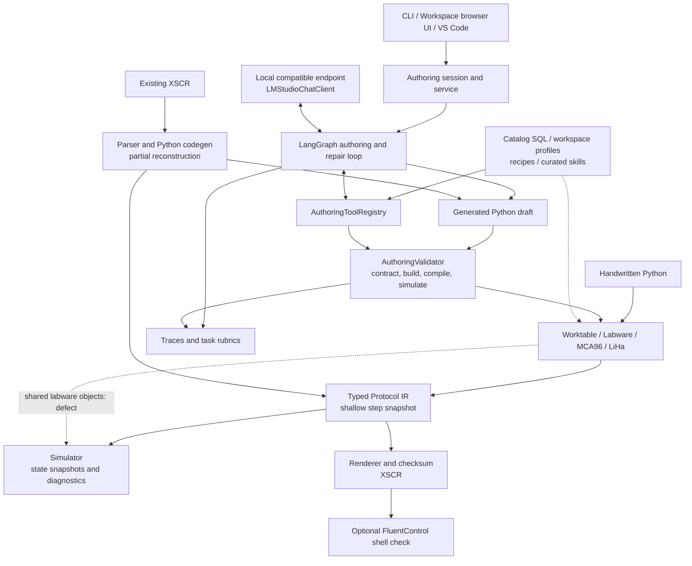
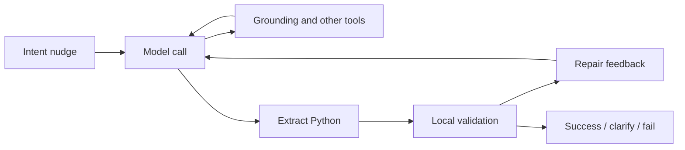
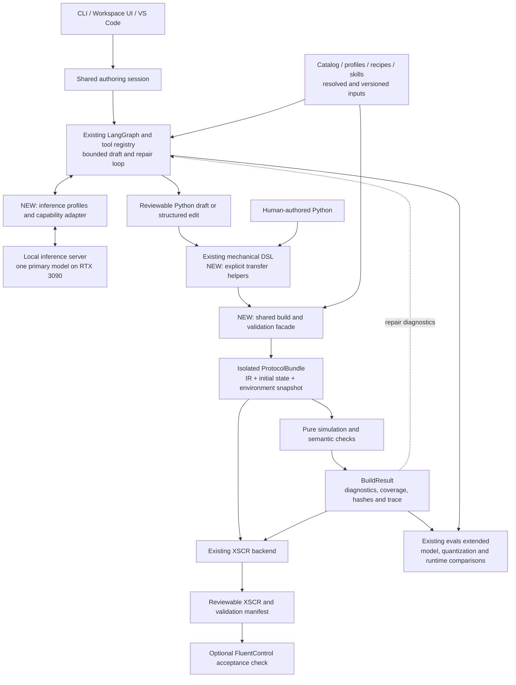

# Fluentvibe architecture and implementation roadmap

Design proposal, 22 September 2026. No implementation changes are included.

Target workstation: RTX 3090 (24 GB VRAM), 96 GB DDR5, Ryzen 9950X. Repository analysis was delegated to Luna; model/runtime candidates were checked against primary sources. Hardware fit and performance below are hypotheses to benchmark, not measured results.

**Recommendation:** retain the Python DSL, typed IR, FluentControl backend, and existing authoring agent. Overhaul state ownership and the shared build lifecycle, then make local inference a measured, first-class authoring capability. The project already has local AI integration; it needs dependable contracts and workload-specific evaluation more than another agent framework.

## 1. As-is architecture

This diagram groups logical responsibilities; it does not imply separate processes or services. Solid arrows show data/control flow; dashed arrows show dependencies or the known shared-state defect.



The CLI also exposes check, catalog, decompile and LSP paths; these do not all go through the authoring agent. Direct Worktable compilation checks selected structural/compatibility conditions but does not invoke simulation. The authoring validator does run multiple gates. The schematic exposes that distinction rather than implying one uniform lifecycle exists today.

### Existing AI workflow



Already implemented: streaming and tool calls, repair policies, tool concurrency, speculative compilation, deterministic/optional model prefetch, catalog/workspace grounding, SQL-backed recipe retrieval, model-assisted curated skill selection, traces, and semantic evaluation rubrics. Their presence is not evidence that every model/profile combination has been validated.

The endpoint defaults to `http://localhost:1234/v1/chat/completions` and the configured model name defaults to `qwen3.6-27b`. This is a code default, not proof that those weights are installed or that a running endpoint serves them. Recipe retrieval uses deterministic hashing, cosine similarity and lexical boosts; it is not an absent subsystem that requires replacement with a vector database.

### Current state and architectural pressure points

| Area | Current assessment | Architectural implication |
|---|---|---|
| Python DSL and typed IR | Substantial implementation, instrument-oriented operations | Preserve the mechanical API and IR boundary |
| Simulation | Broad physical checks; initial-state isolation defect reproduced | Fix before relying on repeated validation or comparative model scoring |
| Compilation | Selected checks and XSCR output; direct compile does not simulate | Introduce a common build result with explicit validation provenance |
| Authoring agent | Existing local endpoint, graph, tools, repair and eval machinery | Improve capability profiles and semantic evaluation, not wholesale replacement |
| Catalog grounding | Rich local data, installation-dependent semantics | Capture resolved installation inputs in build artifacts |
| Decompilation | Known commands reconstruct; unsupported content remains partial/opaque | Preserve fidelity/coverage markers through editing and export |
| UI/editor | Existing integration, incomplete broader coverage | Make all clients consume the same core lifecycle |

Observed state defect: SourcePlate A1 in the simple-transfer example starts at 50 uL, becomes 30 uL after simulation, and 10 uL after a second simulation. `_on_add_labware` shares the authored object with simulated state. Separately, `to_protocol()` copies step lists but shares step objects. Both weaken the meaning of a protocol snapshot.

The previous focused test run passed 24 tests across XSCR round trips, physical invariants and simulator CLI. This proposal does not claim a full-suite or instrument-validation result.

## 2. Proposed architecture

Keep one application/core library and one local inference process. These are module boundaries, not a microservice proposal.



### A. Make protocol state a value

Introduce a serializable `ProtocolBundle`: isolated IR, explicit initial liquid/deck state, and resolved catalog/workspace inputs. Pin or hash referenced assets instead of copying entire installations. The simulator creates private runtime objects from this bundle and returns a result without modifying inputs. Avoid process-local Python object identity as a state-transfer mechanism.

Start with the smallest fix: copy authored labware correctly and deep-isolate snapshots. Then extract the explicit bundle under compatibility wrappers. Give the bundle a schema version and source-step identifiers. The same bundle and environment must produce the same simulation result; emitted checksums/environment-sensitive output need their inputs recorded too.

### B. Unify the build contract

Extract reusable orchestration from `AuthoringValidator`, `Worktable` and check paths into one library facade. Return a `BuildResult` containing the bundle identity, diagnostics, coverage, emitted artifacts, and which gates actually ran. Reuse the same facade from CLI, editor, workspace service, and model tools.

Distinguish `rendered`, `simulated`, and `FluentControl-checked`. These are evidence levels, not synonyms for instrument readiness. A changed source, initial state or installation profile invalidates the prior result. Keep low-level rendering available; user-facing export must display its validation level and must not treat unknown/unsupported steps as checked.

Generated Python remains useful for loops and complex protocols. Execute model-authored builds in an isolated worker with explicit time/resource budgets and scoped file access. A subprocess alone is not a security sandbox; select an OS-supported isolation mechanism. Make this a narrow execution adapter so Windows support does not spread through the DSL.

### C. Add intent-level conveniences without a second competing DSL

Preserve head operations. Add only common, hardware-expressible workflows, starting with full-plate transfer and supported MCA column selections. Keep LiHa offset/loop semantics explicit until a capability-aware selection type can represent them faithfully.

Illustrative proposed API, not implemented syntax:

```python
transfer_plate(
    head=wt.mca96,
    source=src,
    destination=dst,
    volume_per_well_uL=20.0,
    liquid_class=resolved_water_class,
    tips=FreshTips(tip_rack),
)
```

Require explicit tip and liquid-class policies. Lower helpers deterministically to existing operations; preserve an origin ID so diagnostics point back to the transfer intent. Do not hide head constraints, guess reagent classes, or silently change a scientific target to make simulation pass. Missing experimental information should generate a clarification.

A separate high-level IR can wait until concrete planning or optimization requirements justify it. Helpers plus provenance provide most of the immediate value with less migration cost.

### D. Strengthen the existing local authoring agent

Extend the current client behind a provider-neutral interface. Store model identity, quantization, runtime version, chat template, tool parser, context budget, generation settings, streaming support and tested capabilities in named profiles. Transport compatibility does not guarantee equivalent tool behavior.

Use the existing graph for planning, lookup, draft generation, deterministic checks, and bounded repair. Initially use one primary model for all roles: role-specific prompts do not require multiple resident models. Enforce tool-step, retry, output-token and wall-time budgets. On this single GPU, serialize model requests by default while allowing independent CPU/catalog tools to overlap. Benchmark existing speculative/parallel features before enabling them for a local profile.

Expose a small set of typed operations over existing tools: resolve catalog items, inspect a supported API, retrieve examples, submit a draft, validate a candidate, and explain diagnostics. Prefer validated structured edits for small changes; retain Python generation for larger workflows. Models propose changes; deterministic services own catalog identities, protocol state, validation and rendering.

Keep current retrieval as the baseline. Add semantic embeddings or reranking only if held-out lookup cases show a measurable benefit. Use the same task corpus to compare prompting, retrieval and repair changes. Fine-tuning should follow a diagnosed failure pattern and a sufficiently reviewed dataset, not be a prerequisite.

## 3. Local inference on the specified workstation

The user-selected candidates are **Qwen3.8-27B and Qwen3.8-Flash-Next**, replacing the earlier Qwen3.6/GLM shortlist. Start with 27B as the simpler deployment baseline, then compare Flash Next on actual Fluentvibe tasks. Neither has been benchmarked on this workstation during this review.

Use the existing local compatible endpoint if it serves the chosen model correctly. A pinned llama.cpp CUDA server is another candidate for quantization and CPU/GPU offloading; verify exact model architecture, tool-template and embedding-offload support before choosing a runtime build. Generic compatible serving does not prove Flash Next support. Keep one supported deployment first.

| Candidate | Proposed role | Workstation considerations |
|---|---|---|
| Qwen3.8-27B, suitable four-bit or five-bit build | First primary profile for planning, authoring and repair | Dense 27B model. Ideal weight payload is about 13.5 GB at four bits or 16.9 GB at five bits, before quantization overhead, caches and buffers. Benchmark actual 24 GB fit and useful context |
| Qwen3.8-Flash-Next, quantized with CPU/GPU offloading | Competing primary profile | 125B core parameters plus 51B n-gram embeddings and 4B MTP. Ideal four-bit payload is about 88 GB excluding MTP, or 90 GB including it. Actual residency, buffers and offloading determine feasibility on the 3090 plus 96 GB RAM |

Payload estimates are decimal arithmetic, not download sizes or measured memory use. Flash Next activates 6B core parameters per token, but inactive weights still need storage. Its n-gram embeddings have distinct offloading considerations. Measure core weights, embeddings, optional MTP, caches and buffers separately. Available RAM justifies a feasibility experiment; it does not establish fit or interactive throughput.

The adapter should expose per-request thinking controls where the selected runtime supports them. Quick lookup turns and deeper repair turns can use the same loaded model. Benchmark the pair on semantic success, repair success and complete-task latency, including warm/cold starts and model loading. Retain 27B as the baseline unless Flash Next's measured benefit justifies its deployment cost; do not assume either wins before testing.

Begin memory tests with bounded 8K/16K contexts, then increase to task-appropriate lengths. This does not imply reduced context preserves published benchmark capability. Include output/reasoning budgets and tool transcripts. Cache concise workspace summaries and retrieve relevant API fragments to limit repeated context.

Record actual quantized artifact, runtime version, template/parser, offload settings, context limit, peak VRAM/RAM, time to first token, complete-task wall time, tool-call validity, first-pass semantic success, repair success and incorrectly accepted tasks. Make model/runtime capability probes part of P2.

Primary sources checked:

- [Qwen3.8-27B model card](https://huggingface.co/Qwen/Qwen3.8-27B)
- [Qwen3.8-Flash-Next model card](https://huggingface.co/Qwen/Qwen3.8-Flash-Next)
- [llama.cpp inference features](https://github.com/ggml-org/llama.cpp)
- [Ollama tool calls](https://docs.ollama.com/capabilities/tool-calling) and [structured outputs](https://docs.ollama.com/capabilities/structured-outputs)

These sources establish model/runtime capabilities in general; integration compatibility and performance must be verified for the exact selected builds.

## 4. Delivery plan

The dependency sequence below is a proposed implementation backlog, not a calendar commitment. Local-model work starts immediately; reliable end-to-end scoring follows the state fix.

| Phase | Concrete changes | Completion evidence | Depends on |
|---|---|---|---|
| P0: Establish baseline | Inventory installed runtime/model, record configuration, select representative existing protocols, run the complete supported offline suite, identify external-only checks | Reproducible command/config and baseline report; transport smoke test against a real local model | None |
| P1: Repair state ownership | Fix simulator aliasing; isolate `to_protocol()` steps; define explicit initial-state serialization | Repeated and concurrent simulations match; authored state stays unchanged; existing fixtures preserve behavior | P0 |
| P2: Benchmark local profiles | Extend client/profile config and existing eval runner; compare Qwen3.8-27B and Qwen3.8-Flash-Next quantized profiles on the 3090/96 GB workstation | Same task/seed/retry budgets; recorded memory and latency; structured calls and cancellation verified; one default selected from evidence | Transport work after P0; semantic scoring after P1 |
| P3: Shared build result | Extract common validation facade; version bundle and report; record catalog/profile identity; add isolated generated-code worker | Handwritten and generated sources yield equivalent bundles/results; CLI and agent use identical gates; stale results invalidated | P1 |
| P4: DSL and authoring vertical slice | Add plate-transfer helper, explicit policies and source mapping; connect selected local profile to the shared build tools | Natural-language request yields reviewable Python, deterministic simulation and XSCR; ambiguous inputs clarify; repair preserves intended transfers | P2, P3 |
| P5: Expand and stabilize | Add selected MCA/LiHa workflows, compare retrieval improvements, consolidate UI/editor diagnostics, expand real-XSCR fixtures | Held-out workflow report, compatibility checks, unsupported-step fidelity report, installation-backed FluentControl acceptance results where available | P4 |

Proposed first pull requests:

1. **Simulation isolation regression and fix.** Small correctness change; no API redesign.
2. **Protocol snapshot isolation and bundle contract.** Keep old constructors and `compile()` behavior behind adapters.
3. **Local model profiles and benchmark harness extension.** Retain `LMStudioChatClient` compatibility; add runtime/parser capability probes and manifests.
4. **Shared build facade and structured diagnostics.** Delegate existing validation paths incrementally; cover equivalence with existing fixtures.
5. **Plate-transfer helper and source mapping.** Validate emitted IR against the existing mechanical sequence.
6. **One complete local-authoring workflow through UI/CLI.** Use the chosen profile, explicit clarification, bounded repair, and reviewable outputs.

### Evaluation contract

Start with approximately 30 reviewed cases split across full-plate transfers, partial selection/LiHa operations, liquid/tip constraints, and ambiguous or unsupported requests. Use existing rubrics and add expected reagent movements, per-well volumes, selection/head constraints and invariants. Hold out whole protocol variants, not just rewordings. Run each model/profile more than once and report variability.

Do not grade only compilation or model self-assessment. A protocol can compile and simulate while implementing the wrong requested transfer. Compare resulting movements/state against independently reviewed expectations. Include cases where the correct result is a question or an unsupported-operation report. A known invalid case being marked validated blocks the release; an inconclusive model answer is a separately counted outcome.

For each migration stage, preserve compatibility fixtures for supported existing API/XSCR paths. Track source changes, bundle hash, model/runtime configuration, retrieved references, tool results, validation coverage and final artifact identity. This supports diagnosis without saving unbounded prompt dumps.

### First useful milestone

On the RTX 3090 workstation, a user requests a supported plate transfer. A local model resolves actual catalog items and asks about missing scientific parameters, produces a short editable protocol, validates it repeatedly without altering initial conditions, and exports XSCR with a traceable report. The same workflow works from handwritten Python and the existing UI. It neither invents installation-specific identifiers nor drops unsupported commands silently.

This milestone proves the core contracts, local-model usability and DSL ergonomics together. More elaborate planning, larger offloaded models, generalized multi-instrument backends and a new high-level IR can then be judged against concrete needs.

## 5. Repository evidence map

Paths and line numbers refer to the inspected working tree and may move during implementation.

| Evidence | Location |
|---|---|
| Current local endpoint and model defaults | `fluentvibe/authoring/lm_client.py:16` |
| Graph adapter and orchestration | `fluentvibe/authoring/graph.py:298`, `:1781`; `docs/authoring.md:289` |
| CLI entrypoints | `fluentvibe/cli.py:136` |
| Workspace UI/service scope | `docs/workspace-app.md:1` |
| Grounding and validation tools | `fluentvibe/authoring/tools.py:1062` |
| Existing validation pipeline | `fluentvibe/authoring/validator.py:14` |
| Recipe and skill retrieval | `fluentvibe/catalog/dsl_recipes.py:1`; `fluentvibe/authoring/lab_skills.py:251` |
| Snapshot and compilation boundary | `fluentvibe/worktable.py:756`, `:771` |
| Simulator independence contract and shared labware path | `fluentvibe/simulator/walk.py:76`, `:410` |
| Existing mechanical transfer example | `examples/simple_transfer.py:34` |
| Evaluation machinery | `fluentvibe/authoring/eval_rubric.py:1`; `docs/authoring-quality-experiment.md:65` |
| Documented capability gaps | `docs/capability-matrix.md:76` |


